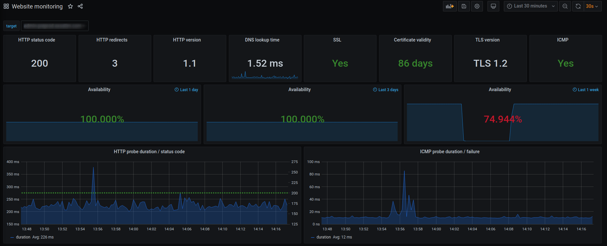
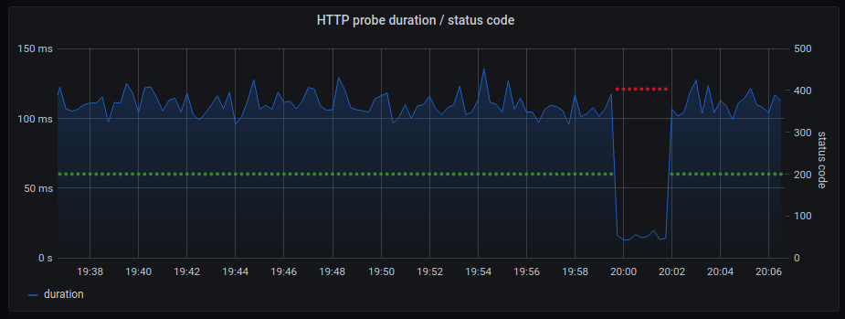
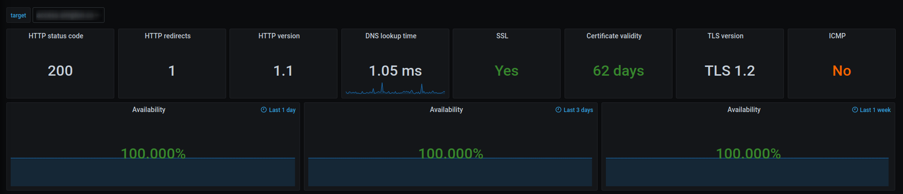
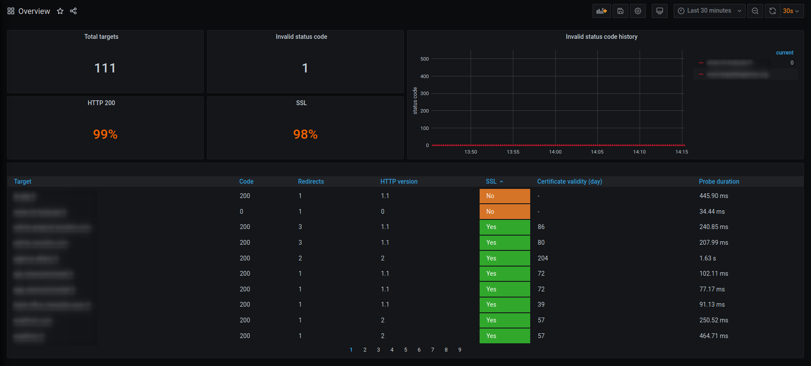

# website-monitoring

Monitore your websites availability, http status code (current and history), certificate, redirects and more with

* [Prometheus](https://github.com/prometheus/prometheus)
* [Prometheus blackbox exporter](https://github.com/prometheus/blackbox_exporter)
* [Grafana](https://github.com/grafana/grafana)

## Dependencies

* [docker](https://docs.docker.com/install/)
* [docker-composer](https://docs.docker.com/compose/install/)

## Usage

* `git clone git@github.com:mbelloiseau/website-monitoring.git && cd website-monitoring`
* Edit `config/prometheus/targets.yml` (see targets.yml.example) or use `./gen_target.sh website-1.tld website-2.tld ...`
* Create and start containers `docker-compose up -d`
* [Visualize dashboards](http://localhost:3000/)

If you already have Prometheus and Prometheus blackbox exporter up and running just import the dashboards ([website-monitoring](dashboards/website-monitoring.json) or [overview](dashboards/overview.json)) and use the right [datasource](screenshots/import.png) and [jobs](screenshots/import.png) (http_job and icmp_job)

## Dashboards

###  Website monitoring
  
* HTTP status code
* HTTP redirects
* HTTP version
* TLS version
* Certificate validity
* ICMP
* DNS lookup time
* Availability over the last 24 hours, 3 days and 7 days
* Probe duration and status code history

### Overview

* Total number of targets
* Percentage of HTTP 200 status code
* Percentage of targets using SSL
* Global invalid status code history

## Tips and tricks

### PromQL

Some useful PromQL queries

* Number of days till certificate expiration
  * `(probe_ssl_earliest_cert_expiry{instance=~"$target",job="$http_job"} - time()) / (60*60*24)`
* Display bad HTTP status code
  * `probe_http_status_code{job="$http_job",instance=~"$target"} != 200`
* Count the number of each status code
  * `count_values("code", probe_http_status_code)`
* Percentage of HTTP 200
  * `((count(count by (instance) (probe_http_status_code == 200))) / (count(count by (instance) (probe_http_status_code)))) * 100`

### Misc

* Request blackbox exporter
  * `curl -s "localhost:9115/probe?module=http_2xx&target=target.tld"`
